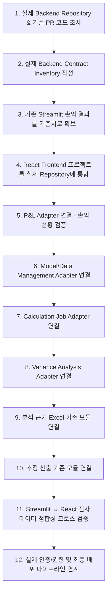

# NANOH2O 손익 분석 업무 시스템 Frontend Integration Handoff Document

본 문서는 NANOH2O 손익 분석 업무 시스템 프론트엔드 UI 프로토타입의 개발 완료 및 동결(UI Freeze) 상태에서, 향후 실제 백엔드 레포지토리(Backend Repository)와 안전하고 체계적으로 통합하기 위한 가이드라인과 인계 사항을 정의합니다.

---

## 1. 현재 상태 (Current Status)

- **Frontend UI**: **`FROZEN (동결 완료)`**
- **최종 Navigation 구조**:
  1. `1. 손익 현황` (`#pnl` / `pnl_status`)
  2. `2. 추정 산출` (`#forecast` / `forecast_generation`)
  3. `3. 손익 분석` (`#variance` / `variance_analysis`)
  4. `4. 데이터 관리` (`#management` / `data_management`)
- **현재 데이터 연결**: Mock Service Layer / Dummy Data 기반 독립 동작
- **실제 Backend 연결 상태**: **미연결 (Unconnected)**

---

## 2. 아키텍처 구조 (Architecture)

### [현재 프로토타입 구조]
```
React View / Component
        ↓
Frontend Service Interface (src/types/service.ts)
        ↓
Mock Service (src/services/*)
        ↓
Dummy Data (src/mocks/*)
```

### [향후 실제 백엔드 통합 목표 구조]
```
React View / Component
        ↓
Frontend Service Interface (src/types/service.ts)
        ↓
Backend Adapter (src/services/adapters/*)
        ↓
실제 Backend (REST API / RPC / DB)
```

---

## 3. 현재 Service 경계 및 인터페이스 파일 매핑

| Service Interface | 정의 파일 경로 | 현재 Mock 구현체 파일 경로 | 주요 역할 |
|:---|:---|:---|:---|
| **`IPnlService`** | `src/types/service.ts` | `src/services/pnlService.ts` | KPI 요약, 2단 월별 추이 차트, 손익계산서, 제조원가, 판관비, Item별 구분손익 조회 |
| **`IVarianceService`** | `src/types/service.ts` | `src/services/varianceService.ts` | 손익 요인 Waterfall 요약, 8개 Effect 분해, 제품/항목별 Drilldown 상세 조회 |
| **`IModelService`** | `src/types/service.ts` | `src/services/modelService.ts` | 모형 목록 조회, 필터/검색, 계획/실적/추정 모형 등록, 선택 삭제 Action |
| **`ICalculationService`** | `src/types/service.ts` | `src/services/calculationService.ts` | 손익 분석 계산 Job 실행, 단계별 상태 조회, 취소, 계산 이력 관리 |

---

## 4. 중요한 주의사항 (Integration Notice)

> [!IMPORTANT]
> 본 프론트엔드 프로토타입은 Service/Adapter 중심의 유연한 통합을 목표로 설계되었습니다.
> 다만, **실제 Backend Contract 확인 결과에 따라 일부 Interface 정의, Service Wiring, Type Mapping 및 UI 연결부 수정이 필요할 수 있습니다.**
> 실제 백엔드 시스템과의 통합 시 발생할 수 있는 오차를 전제로 점진적 어댑팅을 수행해야 합니다.

---

## 5. Frontend Type 원칙 (ViewModel vs DTO)

- **ViewModel 계약 원칙**: `src/types/`에 정의된 타입(`DataModelItem`, `CalculationJob`, `PnlKpiSummary`, `VarianceAnalysisResult` 등)은 데이터베이스 스키마나 백엔드 DTO가 아니며, **UI 컴포넌트 렌더링에 최적화된 프론트엔드 ViewModel 계약**입니다.
- **Adapter 매핑 원칙**:
  $$\text{Backend DTO}\quad\xrightarrow{\text{Adapter Mapping}}\quad\text{Frontend ViewModel}$$
- 백엔드 응답을 프론트엔드 타입에 무리하게 끼워 맞추기 위해 백엔드를 변경하지 않으며, **Backend Adapter 계층에서 데이터 변환(Transformation)을 담당**하도록 합니다.

---

## 6. 실제 통합 시 보호 대상 (기존 자산 재구현 금지)

기존 실제 프로젝트에 이미 검증 및 구현되어 있는 다음 핵심 자산은 프론트엔드에서 임의로 재구현하지 않고 그대로 연계합니다:

1. **추정 산출(Forecast Generation) 엔진 및 파이프라인**: `ForecastGenerationView` Placeholder와 기존 백엔드 산출 로직 연동
2. **분석 근거 엑셀(Excel Download) 생성 모듈**: 수식 및 원천 셀 추적 로직이 포함된 기존 PR 엑셀 생성 기능 연동
3. **손익 계산/분해 엔진**: 실제 8개 Effect 분해, Mix 흡수, 제조경비 배부, Residual 계산 로직
4. **계산 Job / Provenance / 무결성(Checksum) 검증 엔진**
5. **기존 안정화된 백엔드 데이터 처리 및 전처리 로직**

---

## 7. 통합 시 예상 주요 교체 지점

- `MockPnlService` $\longrightarrow$ **`BackendPnlAdapter`**
- `MockVarianceService` $\longrightarrow$ **`BackendVarianceAdapter`**
- `MockModelService` $\longrightarrow$ **`BackendModelAdapter`**
- `MockCalculationService` $\longrightarrow$ **`BackendCalculationAdapter`**

*(주의: 위 지점은 핵심 교체 대상이며, 백엔드 세부 스펙에 따라 부수적인 연결부 수정이 수반될 수 있습니다.)*

---

## 8. 실제 Backend 확인 후 결정할 사항 (Uncommitted Decisions)

다음 항목들은 실제 백엔드 레포지토리의 아키텍처 및 정책을 조사한 후 최종 결정합니다:

- **API 통신 방식**: REST API vs RPC (tRPC / gRPC / Custom RPC)
- **비동기 Job 통신 방식**: Polling vs Server-Sent Events (SSE) vs WebSocket
- **인증 및 권한(Auth/RBAC) 연계 방식**: 세션 쿠키, JWT 토큰, 헤더 주입 방식
- **실제 Backend DTO 스펙 및 에러 코드 체계**
- **모형 파일 실제 업로드 방식**: Multipart Form Data, Presigned URL S3/Supabase Storage 등
- **모형 삭제 정책**: Hard Delete vs Soft Delete vs Archive/Inactive 처리
- **추정 산출 React 화면 연계 방식**
- **분석 근거 엑셀 파일 다운로드 전달 방식**: Direct Binary Stream vs Storage Download Link
- **환경변수 구성**: `VITE_API_BASE_URL` 등 실제 배포 인프라 규격에 맞춤 설정

---

## 9. 실제 통합 권장 순서 (12-Step Integration Workflow)



1. **실제 Backend Repository 및 기존 PR 조사**: 기존 백엔드 엔드포인트 및 DTO 스펙 분석
2. **실제 Backend Contract Inventory 작성**: 요청/응답 스키마와 프론트엔드 인터페이스 간 매핑표 작성
3. **기존 Streamlit 결과를 기준 결과로 확보**: 기존 시스템의 조회 수치를 Gold Standard로 캡처
4. **Frontend 프로젝트를 실제 Repository에 통합**: 디렉토리 배치 및 빌드 스크립트 정합
5. **P&L Adapter 연결**: 손익 현황 KPI, 차트, 손익계산서 데이터 바인딩
6. **Model/Data Management 연결**: 모형 목록, 업로드, 삭제 정책 연계
7. **Calculation Job 연결**: 실제 계산 Job 생성 및 진행 상태 폴링/수신
8. **Variance Analysis 연결**: Waterfall 및 Effect 상세 분해 데이터 바인딩
9. **분석 근거 Excel 기존 기능 연결**: 계산 결과 기반 엑셀 다운로드 연동
10. **추정 산출 기존 기능 연결**: `ForecastGenerationView`와 기존 추정 계산 파이프라인 연결
11. **Streamlit $\leftrightarrow$ React 결과 정합성 확인**: 동일 데이터셋 기준 수치 100% 일치 검증
12. **실제 인증/권한 및 배포 연결**: SSO/로그인 및 프로덕션 빌드 배포

---

## 10. 동결 원칙 (Freeze Policy)

본 문서 작성을 기점으로 프론트엔드 프로토타입 작업은 공식적으로 종료됩니다:

- **UI 재설계 중단**: 확정된 4대 화면 레이아웃 및 UX 동결
- **Mock 비즈니스 로직 확장 중단**: 임의의 Mock 데이터나 가상 계산 로직 추가 금지
- **Service Contract 임의 확장 중단**: 실제 백엔드 조사 전까지 인터페이스 변경 금지
- **Backend 추측 구현 중단**: 가상의 API 엔드포인트나 데이터베이스 스키마 생성 금지

> 실제 백엔드 레포지토리 통합 작업이 시작되기 전까지 본 프론트엔드 프로젝트는 **`Integration Ready`** 상태로 안전하게 보관됩니다.
